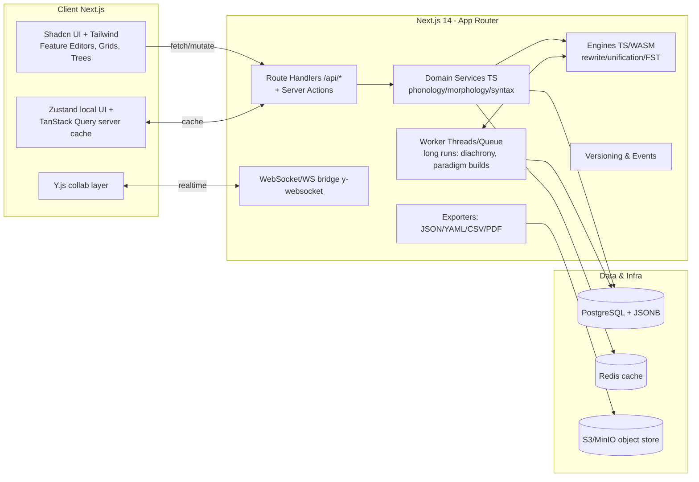

### High-Level Architecture


### 1. Application Architecture
#### Project structure (monorepo via Turborepo)
```shell
apps/
  web/                       # Next.js 14 app (App Router)
    app/                     # routes: /phonology, /morphology, ...
      (dashboard)/...
      api/                   # route handlers (REST/RPC) + server actions
    components/              # UI (atoms/molecules/templates)
    hooks/                   # TanStack Query hooks, auth hooks
    styles/                  # Tailwind config
    lib/                     # adapters: fonts, charts, trees, loaders
    workers/                 # worker-thread entrypoints
packages/
  core/                      # Zod schemas for all modules + shared types
  engines/                   # TS/WASM engines (rewrite, unification, FST)
  visuals/                   # IPA grid, paradigm tables, syntax/family trees
  exporters/                 # JSON/YAML/CSV/PDF pipelines
  testkits/                  # golden cases, property tests, corpus checks
```

#### Module Organization
- `core`: `Language`, `Phonology`, `Morphology`, `Syntax`, ` Orthography`, `Lexicon`, `Diachrony` types mirror the framework's suggested data structures
    - use Zod for validation and JSON schema emission
- `engines`:
  - Rewrite (ordered rules, feature environments) for phonology + diachrony
  - Unification for agreement/case & morpheme selection
  - FST layer (optional WASM) for analyzer/generator and orthography
- `visuals`: IPA grids, paradigm tables, dependency/family trees, script charts -- exactly what the framework prescribes
- `testkits`: unit/proprty/corpus/golden tests reflecting your validation suites

#### Extended & Newly Explicit Modules (Framework Gap Closure)
- **Semantics**: frames, roles, senses, relations (polysemy/metaphor/metonymy), idioms, classifier systems; cached frame→lexeme index; validation for orphan roles and incomplete role filling.
- **Sociolinguistics & Borrowing**: variant overlays + borrowing pipeline (intake → phonological adaptation → morphological integration → semantic tagging); contact events; style/register policies; code-switch profiles (planning placeholder).
- **Psycholinguistic Metrics**: articulatory load, perceptual distinctiveness, morphological opacity, ambiguity, processing load; snapshot metrics after structural edits; advisory suggestions (non-blocking).
- **Diachrony Extensions**: lexical replacement logs, semantic shift logs, innovation tracking across daughter languages; evolution timelines and drift heatmaps.
- **Non‑Concatenative Morphology**: explicit roots, patterns, root–pattern bindings, reduplication templates, ablaut schemes; compiled pattern cache + invalidation rules.
- **Rule Dependency Graph**: explicit dependency edges (precede/follow/same_stratum) + cycle detection; diagnostics for shadowed or dead rules.
- **Security & Multi‑Tenancy**: language membership roles (owner/editor/viewer/guest), audit events, export access gating.

#### Component architecture (UI)
- **Feature Editors** per module (PhonemeGrid, PhonotacticsEditor, RuleTable, TemplateBuilder, ParadigmGrid, SyntaxRules, FamilyTree, ScriptMap)
- **Shared widgets**: FeatureMatrix, NaturalClassBuilder, RuleOrderer (drag-reorder, strata), AllomorphSelector, ToneTierEditor, IGTPreview, TypologyTips
- **New planned widgets**: FrameBuilder, SenseNetworkGraph, IdiomManager, BorrowingWizard, VariantOverlayDiff, MetricsDashboard, EvolutionTimeline, RootPatternBuilder, RuleDependencyGraph
- **Patterns**: presentational (dumb) components + thin containers that bind TanStack Query hooks

#### State Management
- **Zustand**: local ephemeral UI (panel toggles, editors in progress)
- **TanStack Query**: server cache, optimistic updates, invalidation after engine recompute
- **Y.js** (phase 3) for collaboration CRDTs

#### Data flow between modules
- Unified `Language` object; module editors mutate their subtrees
- **Derived artifacts** (e.g., paradigms, derived wordforms) are computed via engines and cached; invalidation is granular (e.g, changing a vowel harmony rule invalidates relevant realizations only).
  - The framework recommends generators/validators and derivation traces -- expose those in a Debug panel

### 2. Data Architecture
#### Database choice
- PostgreSQL with Prisma: relationaal integrity for core objects + JSONB columns for flexible feature bundles and rule payloads (keeps ref integrity while allowing exotic languages).  The framework explicitly allows JSON.YAML or relational schemas with versioning

#### Core schema (selected tables / columns)
- `languages(id, name, slug, created_by, created_at, updated_at, profile_jsonb)`
- `phonemes(id, language_id, ipa, kind, features_jsonb, freq)`
- `phonotactic_rules(id, language_id, name, fsa_jsonb, constraints_jsonb)`
- `phon_rules(id, language_id, name, order, env_jsonb, rewrite_jsonb, stratum)`
- `suprasegmentals(id, language_id, stress_policy, tone_schema_jsonb)`
- `morph_features(id, language_id, name, values_jsonb)`
- `morphemes(id, language_id, form, exponence_jsonb, conditions_jsonb)`
- `templates(id, language_id, slots_jsonb)`
- `syntax_params(id, language_id, word_order, head_dir_jsonb, alignment, agreement_jsonb)`
- `syntax_rules(id, language_id, kind, payload_jsonb)`
- `orthographies(id, language_id, direction, grapheme_map_jsonb, translit_jsonb)`
- `lexemes(id, language_id, lemma, pos, phon, semantics_jsonb, flag_jsonb)`
- `change_sets(id, language_id, name, rules_jsonb, ordering)`
- `families(id, name, topology_jsonb)`
- `variants(id, language_id, name, overlay_jsonb, is_active)`
- `snapshots(id, language_id, event_id, doc_jsonb)`
- `events(id, language_id, kind, actor_id, payload_jsonb, created_at)`

#### New / Extended Tables (gap closures)
- Semantics: `semantic_frames(id, language_id, name, roles_jsonb)`, `lexeme_senses(id, lexeme_id, frame_id, sense_payload_jsonb)`, `sense_relations(id, language_id, source_sense_id, target_sense_id, relation_type)` , `idioms(id, language_id, pattern_jsonb, meaning_jsonb)`, `classifier_systems(id, language_id, inventory_jsonb)`
- Sociolinguistics: `contact_events(id, language_id, source_language, era, domains_jsonb)`, `loan_rulesets(id, language_id, stages_jsonb)`, `style_policies(id, language_id, policy_jsonb)`, `code_switch_profiles(id, language_id, profile_jsonb)`
- Psycholinguistics: `usage_stats(id, language_id, target_kind, target_id, freq, window)`, `complexity_snapshots(id, language_id, version_ref, metrics_jsonb, created_at)`, `metrics_jobs(id, language_id, status, started_at, finished_at)`
- Diachrony extensions: `lexical_change_logs(id, language_id, lexeme_id, change_type, note, created_at)`, `semantic_shift_logs(id, language_id, sense_id, shift_type, trigger_jsonb, created_at)`
- Non‑concatenative morphology: `roots(id, language_id, skeleton, gloss, class)`, `patterns(id, language_id, pattern_key, template_jsonb)`, `root_pattern_bindings(id, root_id, pattern_id, outputs_jsonb)`, `reduplication_templates(id, language_id, spec_jsonb)`, `ablaut_schemes(id, language_id, scheme_jsonb)`
- Rule graph: `rule_dependencies(id, language_id, rule_id, depends_on_id, relation_type)`
- Security & access: `language_members(id, language_id, user_id, role, added_at)`, `security_events(id, language_id, actor_id, kind, created_at)`
- Metrics advisory (optional future): `advisory_suggestions(id, language_id, metrics_snapshot_id, suggestion_jsonb)`

#### Index & Integrity Strategy
- Composite indexes: `(language_id, order)` on ordered rule tables; `(language_id, frame_id)` on `lexeme_senses`; partial index on `variants(is_active)`.
- GIN indexes: feature JSONB fields (`features_jsonb`, `exponence_jsonb`, `grapheme_map_jsonb`, `semantics_jsonb`, `tone_schema_jsonb`, `metrics_jsonb`).
- Foreign keys for all *_id fields; cascading deletes carefully limited (prefer soft-delete via event for audit).
- Dependency edge uniqueness `(rule_id, depends_on_id)` enforced.

#### Hierarchies & dependencies
- **Language families**: stored as topology JSONB plus materialized path for fast traversal; derivative cached tree for visualization
- **Rule dependencies**: in `rule_dependencies` with incremental cycle detection triggers (planned) and periodic full audit job

#### Versioning strategy
- **Event-sourced**: append immutable `events`; periodic `snapshots` (size/time threshold). Deterministic replay required for regression acceptance.
- Event taxonomy (planned): `CREATE | UPDATE | DELETE | IMPORT | BATCH_APPLY | METRIC_RECOMPUTE`.

#### Import/export pipeline
- **Primary JSON** matches framework Appendix A; converters to YAML/CSV and schema validation (Zod)
- **PDF/HTML** reports compile module outputs, tables, trees, script charts; archived with snapshot id

### 3. UI/UX Architecture
- **Dual mode**:
  - Wizard (guided path through Phonology->Morphology->Syntax->Semantics->Orthography->Lexicon->Sociolinguistics->Diachrony->QA & Export)
  - Expert (jump anywhere). Inline validators + "typology tops" are advisory, not blocking
- **Responsive complexity**: use split panes with resizable panels; virtualized tables for large paradigms/lexicons; detail drawers for rule inspection (derivation traces)
- **Accessibility**: IPA input via on-screen palette + keyboard bindings; ensure ARIA labels for special symbols; Noto Sans IPA baseline
- **Real-time previews**: side-by-side panes for (1) underlying forms, (2) derivation steps, (3) surface forms, (4) orthographic render.  Your framework calls for derivation traces and script round-trips; show both
- **Multi-step forms**: React Hook Form + Zod; per-step autosave to events; Undo/Redo from event log
- **New dashboards & panels**: Metrics Dashboard (complexity + trends), Evolution Timeline (lexical & semantic shifts), Borrowing Wizard (loan adaptation stages), Variant Overlay Diff (conflict highlighting), Frame & Sense Network (graph view), Rule Dependency Graph (cycle alerts), Pattern Expansion Preview (non‑concatenative morphology), Register Audit Panel (style policy violations).
- **Advisory surfaces**: Suggestions panel fed by latest metrics snapshot (non-blocking).

### 4. Performance
- **Granular recomputation**: memoize per lexeme/paradigm; incremental recompute on affected rules only; chunked batches for diachronic pipelines
- **WASM where it counts**: compile hot loops (rewrite matcher, FST composition) to WASM; fall back to TS
- **Caching**: Redis for computed artifacts and "typology profile" summaries; HTTP cache headers on exports
- **Lazy loading**: code-split visuals (syntax/family trees, large grids)
- **Client vs server**: do heavy rule application, family generation, and PDF export server-side/worker; keep lightweight validation client-side (phonotactics FSA check)
- **Additional caching layers**: Redis keys for paradigm_cache, frame_index_cache, derivation_trace_cache (LRU), metrics_latest.
- **Invalidation mapping**: entity-type → cache bucket map (e.g., changing a root affects only its root_pattern_bindings and derived paradigms; changing a pattern invalidates bindings referencing it).
- **Batch & debounce**: metrics recomputation debounced (e.g., 5m after last structural edit); borrowing intake deduplication within job window.
- **Future WASM candidates**: rewrite matcher, FST composition, pattern expansion.

### 5. Integration Architecture
- **IPA & fonts**: Noto Sans IPA by default; support uploaded OTF/TTF for custom scripts; allow PUA mappings and embedded fonts; as your framework recommends for custom orthographies
- **Phonological engine**: ordered rewrite with feature-based environments + strata; derivation trace output
- **Morphological analyzer/generator**: feature unification over templates, allomorph selector (phonological + morphosyntactic), syncretism detection; generate full paradigms & IGT labels
- **Exports**: JSON/YAML/CSV;**PDF/HTML** language report with paradigms, rule listings, and charts; script charts auto-generated from mapping tables
- **Borrowing pipeline integration**: staged transformations invoking subset of rewrite rules + morphological integration selector, producing audit trail entries.
- **Metrics integration**: metrics job consumes snapshots + frequency (usage_stats) to compute updated complexity_snapshots.

### 6. Testing strategy
- **Unit**: per-module generators/validators (phonotactics, rule, templates)
- **Integration**: end-to-end derivations with golden files; canonical sentence generations; round-trip script tests
- **Property-based**: phonotactic closure, agreement always resolves, no stranded tones
- **Regression**: diachronic pipeline outputs compared across versions (stable unless change sets updated)
- **UAT**: Wizard flow completion, expert edits, export correctness; typology flags visible but non-blocking
- **Extended Validation & Testing Additions**
  - Tone association integrity (no stranded or duplicate tone links).
  - Orthographic round‑trip (script ↔ transliteration) for every orthography version.
  - Semantic role coverage (no predicate with missing obligatory roles in sample outputs).
  - Overlay conflict detection tests (incompatible rule delta merges flagged pre‑persist).
  - Rule dependency cycle & dead rule detection tests.
  - Metrics idempotence (re-run without structural change produces identical snapshot hash).
  - Non‑concatenative pattern completeness (all roots × required pattern sets where mandated).
  - Borrowing adaptation completeness (every foreign segment mapped or whitelisted as loan retention).

### 7. API Endpoint Structure (Expanded)
Existing endpoints retained; new planned endpoints for extended modules:
- `/api/languages/[id]/semantics/frames` (CRUD)
- `/api/languages/[id]/semantics/senses` (CRUD)
- `/api/languages/[id]/semantics/idioms` (CRUD)
- `/api/languages/[id]/sociolinguistics/variants` (CRUD)
- `/api/languages/[id]/sociolinguistics/borrowing` (intake + adaptation status)
- `/api/languages/[id]/metrics` (latest metrics snapshot; recompute trigger)
- `/api/languages/[id]/metrics/history` (list snapshots)
- `/api/languages/[id]/diachrony/lexical` (batch lexical evolution)
- `/api/languages/[id]/history/timeline` (aggregated event + change logs)
- `/api/languages/[id]/rule-graph` (dependency inspection)
- `/api/languages/[id]/security/members` (membership management)

### 8. Security & Multi‑Tenancy
- Per-language membership roles (owner/editor/viewer/guest) in `language_members`.
- Event visibility restricted to members; export access checked against role.
- Audit events for membership changes, exports, metrics recompute triggers.
- Rate limiting on borrowing intake and metrics recompute endpoints.
- Export scrubbing: donor language metadata excluded unless explicitly permitted.

### 9. Psycholinguistic Metrics Layer
- Metrics domains: articulatory load, perceptual distinctiveness, morphological opacity, ambiguity, processing load.
- Data sources: usage_stats (frequency), derivation traces (ambiguity), syllable inventory (cluster complexity), lexeme inventory (homophony density).
- Snapshots stored in `complexity_snapshots`; advisory suggestions generated optionally.
- Debounced recomputation; idempotent hashing of input state to avoid duplicate snapshots.

### 10. Sociolinguistics & Borrowing Pipeline
- Stages: intake (donor form + metadata) → phonological adaptation → morphological integration → semantic adjustment (optional) → registration in lexicon with loan flags.
- Style policies evaluate register constraints; Register Audit Panel lists violations.
- Variant overlays resolved in precedence chain; conflict detection prior to persistence.

### 11. Diachrony Extensions
- Lexical change logs capture replacements/taboo cycles; semantic shift logs classify drift types.
- Evolution timeline aggregates sound changes, lexical replacements, semantic shifts per version interval.
- Drift analysis heatmap by semantic field.

### 12. Non‑Concatenative Morphology Modeling
- Root skeleton + pattern mapping; compiled pattern cache keyed by (root_class, pattern_id).
- Reduplication templates and ablaut schemes embedded in selection pipeline.
- Syncretism detection extended to non‑concatenative outputs.

### 13. Rule Dependency & Cycle Detection
- `rule_dependencies` edges; insertion-time incremental cycle check; periodic full audit worker.
- Diagnostics classify: cycle, shadowing (later rule fully overrides earlier), dead rule (never matches), unreachable environment.
- UI graph with colored edge types and suggested reorder operations.

### 14. Performance & Caching Enhancements
- Additional Redis namespaces: paradigms, frames, metrics, derivations.
- Selective invalidation; no global flush on local edits.
- Batch processing windows for diachrony and metrics to avoid thrashing.

### 15. Phased Implementation Roadmap
- Phase 1: Schema corrections, semantics core tables, non‑concatenative morphology entities, validation (tone, orthography).
- Phase 2: Borrowing pipeline, variant conflict detection, initial metrics (cluster complexity, homophony), new UI widgets baseline.
- Phase 3: Diachrony lexical & semantic change logs, evolution timeline, expanded metrics suite + advisory suggestions.
- Phase 4: WASM optimizations (rewrite, pattern expansion), collaboration (Y.js) integration with event bridging, rule dependency graph UI.
- Phase 5: Security hardening (roles, audit), deterministic replay gating in CI, performance regression benchmarks.

### 16. Risks & Mitigations (Concise)
- Schema scope creep → per-phase migration design docs & acceptance criteria.
- Metrics cost inflation → incremental diff computation + debounced jobs.
- Borrowing DSL complexity → start minimal (feature-based substitution) then iterate.
- Event log growth → snapshot compaction + archival retention policy.

### 17. Requirements Alignment Summary
- Semantics depth: addressed via new tables & UI.
- Sociolinguistics completeness: borrowing/variants/style policies added.
- Psycholinguistics: metrics layer defined.
- Historical lexical/semantic change: change logs & evolution timeline.
- Non‑concatenative morphology: explicit schema & engine cache.
- Validation breadth: tone, orthography, semantics, overlays, rule graph, metrics.
- API coverage: new endpoints enumerated.
- Versioning clarity: event taxonomy & snapshot cadence.
- Security/multi-tenancy: roles, audit, rate limits.
- Performance: targeted caching & WASM roadmap.
- Rule dependency: explicit edge model & diagnostics.

---
(End of extended architecture; earlier sections remain authoritative where not superseded.)
